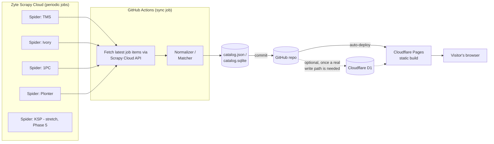

# PC Part Picker (Israel) — Build Plan

*Drafted August 2026, revised same month after confirming GitHub Education Pack benefits. Free-tier terms for every platform mentioned below change often — re-check each provider's pricing page before you commit, especially the database and hosting layer.*

## 0. For AI agents / future contributors reading this

This is a living planning doc, not a finished spec. If you're an agent picking this project up:

- **Read §17 (Decision Log) before proposing an alternative architecture.** Several "obvious" alternatives (Firebase, Vercel, plain GitHub Actions cron) were already considered and rejected for stated reasons below — don't re-litigate them without new information; if you disagree, say why against the specific reason given, don't just re-suggest the default.
- **Current status: planning stage, no code written yet.** Start at Phase 0 in §16.
- Treat this file as the source of truth for *why* decisions were made. If you make a new architectural decision while implementing, add it to §17 rather than letting the reasoning live only in a commit message or chat history.
- Don't build the permanent architecture on anything tied to student verification (§3) without preserving a fallback path — see the risk note at the end of §3.

## 1. What we're building

A PCPartPicker-style site for the Israeli market: scrape prices/specs from local vendors, normalize them into one catalog, let users build a parts list with compatibility checking, and show which vendor has the best current price per part.

Three sub-systems, and they should be built and tested separately:

1. **Scraper** — pulls raw listings from each vendor daily.
2. **Catalog/matcher** — turns messy per-vendor listings into one canonical product catalog with compatibility attributes.
3. **Site** — lets people browse, filter, build a rig, and see prices.

Worth saying up front: (2) is the part people usually underestimate. Scraping is a solved problem; reliably knowing that "TMS's listing" and "Ivory's listing" are the *same* GPU is the actual hard engineering problem in this project. Compatibility checking (§6) is comparatively easy — it's a rules engine over clean structured attributes, not a hard problem in its own right, as long as the catalog data feeding it is clean.

## 2. Prior art worth looking at

- **PCPartPicker** itself — study its compatibility rule set (socket, RAM type/speed, PSU wattage vs. total draw, GPU length vs. case clearance, cooler height vs. case clearance, M.2 slot count, form factor).
- **Zap.co.il** — an existing Israeli price-comparison site that already aggregates PC-hardware prices across vendors. Worth a look for two reasons: it proves the vendor-scraping model works in Israel long-term, and its category structure is a decent reference for how to bucket products.

## 3. Available resources — GitHub Education Pack

You have GitHub Pro + the Student Developer Pack. The relevant benefits for this specific project:

| Benefit | What it gives you | How it's used here |
|---|---|---|
| **Zyte Scrapy Cloud** | 1 Free Forever unit: unlimited crawl time, unlimited requests, 120-day job data retention, real periodic-job scheduling (the *paid*-tier feature set, not the crippled default free tier which caps jobs at 1hr/7-day retention and has no scheduler) | Primary scraper execution + scheduling environment — see §9 |
| **Namecheap** | Free `.me` domain + SSL for 1 year, renewable while verified | Removes the one genuinely non-free line item in §15 |
| **Sentry** | Free while a student | Error alerting for the scrape pipeline, better than relying only on GitHub's failure emails |
| **DigitalOcean** | $200 credit, valid 1 year | Time-limited sandbox — e.g. testing a self-hosted Actions runner or a persistent Playwright box if a vendor needs one. **Not** a foundation for the permanent architecture, since the credit expires |
| **Microsoft Azure** | $100 credit | Same category as DigitalOcean — sandbox budget, not permanent infra |
| **JetBrains (PyCharm etc.)** | Free IDE licenses while a student | Nice-to-have for writing the Scrapy spiders |
| **MongoDB Atlas** | $50 credit + free certification | Not currently needed (see §17 on why Postgres/D1 over Mongo for this data shape), noted in case that changes |

**Risk to flag explicitly:** Scrapy Cloud's unit, the free domain, and Sentry are all tied to active GitHub Student verification. If that status lapses (graduation, re-verification failure, program changes), these can revert to paid or disappear. Keep the "Option A: git as database" architecture (§4) and a plain-GitHub-Actions-cron scraper path (§9, "fallback") always viable as a no-dependency baseline, so losing a perk degrades the project rather than breaking it.

## 4. Architecture

### Option A — "Git as the database" (recommended for MVP)

Scraper (now: Scrapy Cloud, see §9) produces results → a sync step pulls them and writes JSON (or a SQLite file) → commits it to the repo → static site rebuilds and reads that file. No external database service for the read path at all.

- **Zero moving parts to keep alive** on the storage side. Nothing pauses, nothing expires, nothing needs a credit card on file.
- Frontend does client-side filtering. Two equivalent ways to implement this — pick whichever reads more naturally to whoever's building it:
  - **Plain JS over JSON**: `allCpus.filter(cpu => cpu.socket === board.socket)`.
  - **Real SQL over an in-browser SQLite file**: ship `catalog.sqlite` instead of `catalog.json`, query it with `sql.js` (SQLite compiled to WebAssembly) — `SELECT * FROM cpus WHERE socket = ?` runs as literal SQL, entirely in the visitor's browser, no server involved.
  
  These are the same operation (a predicate scan over a small in-memory dataset) — `.filter()` isn't a weaker substitute for `WHERE`, it's the same relational-algebra selection running in a different engine. Either is sub-millisecond at a catalog of a few thousand products, no server round-trip needed. A live database's real advantage (indexes, query planning) starts to matter at a much larger scale than this catalog will hit — see §17 if this still feels off.
- The data file can also be served straight off GitHub via jsDelivr's GitHub CDN (`cdn.jsdelivr.net/gh/user/repo@main/data/catalog.json`), free, fast, and versioned for free as a side effect (every day's snapshot is just a commit).
- Ceiling: this comfortably handles thousands of products with daily history. It stops making sense once you want live server-side write operations (user accounts, saved builds synced across devices, an admin UI with concurrent multi-editor access) — that's Option B.

### Option B — Static frontend + a real free database

Add this once you need a *write* path from users, not because compatibility checking demands it (it doesn't — see §17):

- **Cloudflare D1** (SQLite-based, serverless), pairs naturally with Cloudflare Pages Functions — one vendor, one dashboard. Free tier: 5 GB storage, 5M reads+writes/month. For context: 10,000 products × 365 daily price snapshots ≈ 3.65M rows/year at maybe 100 bytes/row ≈ 365 MB/year — comfortably inside the free tier for years.
- **Neon** (serverless Postgres) for standard Postgres/SQL tooling. Free tier scales to zero after idle and wakes in ~1 second — since the pipeline touches it daily anyway, it never has time to go stale.
- **Supabase** (Postgres + auth + storage bundled) if built-in user accounts are wanted. Free projects pause after 7 days with zero API requests — a daily pipeline write counts as activity and keeps it alive automatically, but don't rely on this if scraping ever pauses for a while.
- Avoid Render's free Postgres — it expires 30 days after creation, a bad fit for something meant to accumulate history.



## 5. Tech stack summary

| Layer | Recommendation | Why | Cost |
|---|---|---|---|
| Scraper framework | Scrapy (Python), one project, one spider per vendor | Runs natively on Scrapy Cloud; `scrapy-playwright` middleware handles JS-heavy vendors within the same framework | Free (Scrapy Cloud unit) |
| Scraper execution + scheduling | Zyte Scrapy Cloud, periodic jobs | Real scheduler, unlimited crawl time, no cron-drift/auto-disable issues GitHub Actions has | Free (Education Pack) |
| Sync + deploy trigger | GitHub Actions, scheduled (or triggered after the Scrapy Cloud job) | Pulls results via Scrapy Cloud API, commits to repo | Free on public repo |
| Data store (MVP) | JSON/SQLite committed to repo, served via jsDelivr GitHub CDN | Zero infra, versioned for free | Free |
| Data store (v2) | Cloudflare D1 | Generous free tier, same ecosystem as hosting | Free within 5 GB / 5M ops/month |
| Frontend | Astro or Next.js (static export) | Fast static builds for a content-heavy catalog site | Free |
| Hosting | Cloudflare Pages | Unlimited bandwidth, 500 builds/month, commercial use allowed on the free tier (unlike Vercel Hobby) | Free |
| Domain | Namecheap free `.me` via GitHub Education (1yr, renewable while verified) | Removes the one non-free line item | Free while verified |
| Monitoring | Sentry (free while student) + GitHub Actions failure emails | Catch scraper breakage and site errors | Free |

## 6. Data model

Two tables/collections do most of the work:

**`listings`** — raw, per-vendor, one row per (vendor, product, day):
```
vendor_id, vendor_sku, title_raw, price_ils, in_stock, url, scraped_at, category_guess
```

**`products`** — the canonical catalog, one row per real-world part:
```
product_id, canonical_name, category, brand, model,
attributes (JSON — socket / chipset / form_factor / wattage /
            memory_type / pcie_version / length_mm / tdp_w / …),
vendor_links: [{vendor_id, vendor_sku, current_price, url, last_seen}]
```

Use a flexible `attributes` JSON blob per category rather than one giant rigid schema — CPU, GPU, PSU, and case attributes have almost nothing in common, and scraped specs are inconsistently formatted across vendors anyway. A loose schema lets you improve extraction over time without migrations.

Compatibility rules are predicate checks run client-side — either JS/TS functions over the JSON, or literal SQL `WHERE` queries over an in-browser SQLite file via `sql.js` (see §4). Neither needs a live database server; see §17 for why "filtering" doesn't imply "needs a hosted DB." The checks themselves: socket match (CPU↔motherboard), RAM type/speed support, PSU wattage vs. sum of component draw + headroom, GPU length vs. case max-GPU-length, cooler height vs. case max-cooler-height, case form factor vs. motherboard form factor, M.2/SATA slot counts. Build this incrementally — don't try to model every edge case (e.g. BIOS-update-required CPU support) on day one.

## 7. Vendor scraping strategy

For **each** vendor, before writing a spider:

1. Check `https://<vendor>/robots.txt`.
2. Open the site's Network tab and look for a JSON/XHR endpoint the storefront itself calls (many storefronts are React/Vue apps backed by a JSON API) — scraping that endpoint directly is far more stable than parsing rendered HTML.
3. Check the page encoding. Some older Israeli retail sites still serve **Windows-1255** instead of UTF-8 for Hebrew text — if you see mojibake, this is almost always why. Detect and decode explicitly rather than assuming UTF-8.
4. Note whether listing pages are server-rendered (plain Scrapy `Request`/`Selector` is enough) or JS-driven/infinite-scroll (needs `scrapy-playwright`).

Rough difficulty ranking:
- **TMS, Ivory, 1PC, Plonter** — likely standard server-rendered category pages; start here. Get the full pipeline (spider → sync → normalize → match → commit) working end to end on these before touching KSP.
- **KSP** — flagged as hard; treated as a stretch goal, not part of the MVP. See §10.

Each vendor is its own Scrapy `Spider` class in the same Scrapy Cloud project, sharing a common `Item` schema, so adding/removing a vendor never touches the normalizer or site code.

## 8. Product matching / deduplication — the hard problem

This is where most scraper-aggregator side projects stall, so plan for it explicitly.

- **Extract structured signals from messy titles.** Hebrew/English mixed titles like `כרטיס מסך RTX 4070 Ti Super 16GB` need regex/keyword extraction for brand, model number, capacity, etc. — don't match on the raw title string.
- **Use a canonical SKU/model number where a vendor exposes one** (often in the URL slug or a spec table, more reliable than the display title).
- **Fuzzy-match as a fallback**, not a first resort — e.g. `rapidfuzz` on the normalized (brand+model+capacity) string, with a confidence threshold. Anything below threshold goes to a review queue, not straight into the catalog.
- **Build a tiny manual-merge admin view early**, even if it's just a local script. Automatic matching will be wrong often in the first weeks; a human-in-the-loop confirm/merge step is what actually gets a clean catalog, and the corrections become tuning signal for the matcher.
- Store the vendor→product mapping explicitly (`vendor_sku → product_id`) once confirmed, so a listing only needs matching once, not every day.

## 9. Scheduling — Zyte Scrapy Cloud + GitHub Actions

**Primary path (uses the free Education Pack unit):**

1. Deploy the Scrapy project to Scrapy Cloud (`shub deploy` or via the dashboard).
2. Set up a **Periodic Job** per spider (or one wrapper spider that runs all vendors) in the Scrapy Cloud dashboard — this is Scrapy Cloud's own scheduler, comparable to cron, and doesn't inherit GitHub Actions' timing drift.
3. A lightweight **GitHub Actions workflow, scheduled ~1–2 hours after the expected Scrapy Cloud run**, calls the Scrapy Cloud API to fetch the latest job's items, runs the normalizer/matcher, commits `data/catalog.json`, and pushes. Cloudflare Pages auto-deploys on push — no separate deploy step.

This split matters: GitHub Actions' known quirks (UTC-only scheduling, 10–30+ minute delivery drift, scheduled workflows auto-disabling after 60 days of repo inactivity) now only affect a "sync whatever's newest" step, not the actual scraping. A day where the sync runs late just means the site is a few hours stale, not that a scrape was silently skipped.

```yaml
name: sync-and-deploy
on:
  schedule:
    - cron: '0 4 * * *'   # buffer after the Scrapy Cloud periodic job — GitHub cron is UTC only
  workflow_dispatch: {}
jobs:
  sync:
    runs-on: ubuntu-latest
    steps:
      - uses: actions/checkout@v4
      - run: pip install -r requirements.txt --break-system-packages
      - run: python scraper/sync_from_scrapy_cloud.py   # pulls latest job items via Scrapy Cloud API
      - run: python scraper/normalize_and_match.py
      - run: git config user.email "bot@example.com" && git config user.name "sync-bot"
      - run: git add data/ && git commit -m "sync $(date -u +%F)" && git push
```

Add a sanity check at the end: fail loudly if today's item count is zero or drastically down from yesterday's — this is what actually catches "a vendor changed their HTML and the scraper now silently returns nothing," and it's cheap insurance regardless of which scheduler triggered the run. Wire failure notifications through Sentry rather than relying solely on GitHub's default failure emails.

**Fallback path (no Scrapy Cloud dependency):** if the Education Pack perk ever lapses, the same spiders can run directly inside a GitHub Actions job on a daily cron (`playwright install`, run Scrapy locally in the runner, commit results) — slower to detect breakage and subject to GitHub's cron quirks directly, but it's a plain, dependency-free path that always works on a public repo. Worth keeping this script working even while Scrapy Cloud is the primary path, purely as insurance.

## 10. KSP and anti-bot vendors

Flagged as hard for a reason — larger Israeli e-commerce sites commonly run WAF/bot-management. Two parallel tracks, neither blocking the rest of the build:

1. **Official API.** You mentioned KSP has one and enrollment requires approval. Worth submitting that application now (Phase 0, non-blocking) since approval latency is unknown — if it comes through, it's a more stable, more ethical integration than scraping around bot defenses, and removes this whole problem.
2. **Scraping as a fallback**, only revisited in Phase 5 after everything else is solid. Note that Scrapy Cloud's own IPs aren't automatically better-positioned against a WAF than GitHub Actions' — scraping-infrastructure IP ranges are frequently the specific thing bot-management products are tuned to flag. If it comes to this: keep requests slow and infrequent, use a realistic user-agent, and don't build anything specifically designed to defeat CAPTCHA challenges or spoof detection signatures — beyond the legal ambiguity, that's also the fastest way to get permanently blacklisted, which is worse for a long-running daily job than just not covering that vendor.

Bottom line, matching what you said: don't build anything for KSP yet. Get the other four vendors working end to end first.

## 11. Legal & ethical considerations (not legal advice)

- Check each vendor's `robots.txt` and Terms of Service before scraping it. Scraping publicly visible prices for a comparison site is a well-established model (Zap does exactly this), but individual sites' ToS can still explicitly prohibit automated access — a real risk factor to weigh, not a formality.
- Rate-limit yourself. A few requests per second sustained over minutes is a completely different load profile than a burst.
- Only store and display what's needed (price, availability, spec, link back to the vendor's product page). Linking out to buy, rather than trying to replace the vendor's own page, is what keeps this in "comparison site" territory.
- If a vendor formally asks you to stop, stop for that vendor.
- None of this is legal advice specific to Israeli law — if this grows past a personal side project (ads, paid features, real traffic), a short consult with someone who practices in this area is worth it.

## 12. Data growth & retention

Daily snapshots of every listing add up. Default: keep full daily granularity for the trailing ~90 days, then collapse older history to weekly/monthly aggregates. Build the downsampling job as its own scheduled step, separate from the daily sync.

Note: Scrapy Cloud's 120-day job-data retention is not your long-term store — the git repo (or D1, later) is. As long as the sync job runs regularly and commits, Scrapy Cloud's retention window is a non-issue; it would only matter if syncing stopped for months.

## 13. Hosting & deployment

- **Cloudflare Pages** connected to the GitHub repo: every push to `main` (including the daily sync commit) triggers a rebuild automatically.
- If Option B is needed later (D1, Pages Functions for e.g. a saved-build share link), it lives in the same Cloudflare account/dashboard as hosting.
- Domain: Namecheap's free `.me` via GitHub Education for a real custom domain at $0 while verified; the default `*.pages.dev` subdomain is a fine $0-forever fallback if that lapses.

## 14. Repo structure (suggested)

```
/scraper                    # a Scrapy project
  /spiders
    tms.py
    ivory.py
    onepc.py
    plonter.py
    ksp.py                   # stretch, isolated so it can fail without blocking the rest
  items.py                    # shared Item schema across vendors
  sync_from_scrapy_cloud.py   # pulls latest job items via Scrapy Cloud API
  normalize_and_match.py      # title parsing, attribute extraction, canonical matching
  scrapy.cfg
/data
  catalog.json                 # or catalog.sqlite — the "database" in Option A
  history/                      # daily snapshots, if kept separate from the live catalog
/site
  ...Astro/Next.js app...
/.github/workflows
  sync-and-deploy.yml
  weekly-downsample.yml
```

## 15. What could actually push you off "free"

| Risk | What triggers it | Mitigation |
|---|---|---|
| Cloudflare Pages build minutes | >500 builds/month | One build/day is ~30/month — nowhere close |
| D1 storage/ops | >5 GB or >5M reads+writes/month | Retention policy in §12; batch writes |
| GitHub Actions minutes | N/A if repo stays public | Keep the repo public |
| Supabase project pause | 7 days with zero API calls | A daily write keeps it alive — only bites if the pipeline stops |
| Scrapy Cloud unit, Namecheap domain, Sentry | Loss of verified student status | Keep the no-dependency fallbacks in §3/§9 working |
| Custom domain, if the Namecheap perk lapses | Losing student verification | `*.pages.dev` subdomain remains free indefinitely as a fallback |

## 16. Phased roadmap

1. **Phase 0 — recon (do this now, low effort).** Check robots.txt/ToS for each vendor. Inspect each site for a JSON API vs. HTML-only. **Submit the KSP official API enrollment request now** — non-blocking, just starts the clock. Set up the Scrapy Cloud account and deploy an empty test project to confirm the free unit and periodic-job scheduling work as expected.
2. **Phase 1 — MVP pipeline.** One Scrapy spider working end to end for 2 easy vendors → Scrapy Cloud periodic job → GitHub Actions sync → JSON in repo → a bare-bones static page listing raw scraped prices (no matching/compatibility yet). Prove the whole loop runs unattended for a week before building anything else.
3. **Phase 2 — matching.** Add the remaining easy vendors (TMS, Ivory, 1PC, Plonter). Build the normalizer + fuzzy matcher + manual-merge review step. Get to one clean canonical catalog.
4. **Phase 3 — compatibility & builder UI.** Attribute schema per category, compatibility rule engine, the actual "build a PC" flow.
5. **Phase 4 — history & polish.** Price history charts, RTL Hebrew layout, search/filtering, retention/downsampling job.
6. **Phase 5 — KSP (optional).** Check on the API application from Phase 0 first — if approved, integrate via API (much simpler than scraping). Only fall back to scraping it if that doesn't come through and it's still worth the maintenance burden.

## 17. Decision log

**Why Cloudflare Pages over Vercel?** Vercel's free Hobby plan is explicitly non-commercial-only per its ToS; Cloudflare Pages' free tier permits commercial use and has unlimited bandwidth vs. Vercel's 100GB/month cap. Vercel's DX edge is real for heavy Next.js server-feature use (ISR, edge middleware), but this project doesn't need those for a mostly-static catalog. Revisit only if the frontend grows a real need for Vercel-specific server features.

**Why "git as database" and not Firebase/Supabase from day one?** Compatibility checking (CPU↔motherboard socket, PSU wattage, GPU/case clearance) is rule evaluation over structured JSON attributes — it needs clean data, not a relational database or live server. A catalog of a few thousand products filters client-side in milliseconds. A real database earns its place when there's a *write* path from users (accounts, saved builds across devices, multi-editor admin curation) — not before. Firebase specifically was passed over partly because its free tier has been actively trimmed recently (Cloud Storage removed from the Spark plan, Firebase Studio discontinued, both in early 2026) — a reminder that "free forever" claims need periodic re-verification even from large vendors. If/when a DB is added, Cloudflare D1 (same ecosystem as hosting) or Neon/Supabase Postgres are preferred over Firebase for this project.

**Why Scrapy Cloud over plain GitHub Actions cron for scraping itself?** GitHub Actions' schedule trigger has real, documented drift (10–30+ minutes, occasionally more) and silently disables scheduled workflows after 60 days of repo inactivity. The GitHub Education Pack's free Scrapy Cloud unit includes real periodic-job scheduling and unlimited crawl time, purpose-built for exactly this. GitHub Actions is repurposed as a "sync results + commit + let Cloudflare deploy" step instead, which is more tolerant of timing slop. Tradeoff: this is a perk tied to active student verification — hence the fallback path documented in §9.

**"Find all CPUs compatible with this motherboard" is a `WHERE socket = ?` query — doesn't that need a real database?** No, and this is worth being explicit about since it's an easy thing to get wrong: a SQL `WHERE` clause and a JS `Array.filter()` call are the *same operation* — a predicate scan over a collection, keeping rows/items where a condition is true. `allCpus.filter(cpu => cpu.socket === board.socket)` is not a stand-in for 200 manually written if-statements; it's one declarative filter, exactly like the SQL version. The only real difference is which engine executes the scan. A live database's actual advantage — indexes, query planning, avoiding a full scan — starts to matter at a scale (millions of rows, concurrent queries from many users hitting a server) this project won't reach for read-only catalog filtering. If writing literal SQL matters for its own sake (familiarity, not wanting to think in `.filter()` chains), that's still available with zero server: ship the catalog as a `.sqlite` file and query it client-side with `sql.js` (SQLite compiled to WASM) — see §4. The trigger for a *live* database isn't "does this need a query," it's "does this need a write from a browser, server-side computation over a dataset too large to ship to the client, or concurrent access control" — none of which apply to compatibility filtering itself.

**Why is KSP out of scope for now?** Explicit instruction: get the pipeline solid on easier vendors first. Its official partner API (enrollment pending approval) is the preferred long-term integration path over scraping around its bot defenses; the application was moved to Phase 0 purely because submitting it costs nothing and approval timing is unknown, not because KSP work starts now.

## 18. Open questions for you to decide

- Full site in Hebrew, English, or bilingual? (Affects RTL layout work and title-parsing language handling.)
- Do you want user accounts/saved builds (pushes toward Option B sooner), or is a shareable-link build good enough?
- Is KSP actually required for v1, or a nice-to-have contingent on the API approval?
- Who's maintaining scraper selectors when a vendor redesigns their site? (This will happen — budget for it as ongoing maintenance, not a one-time build.)
